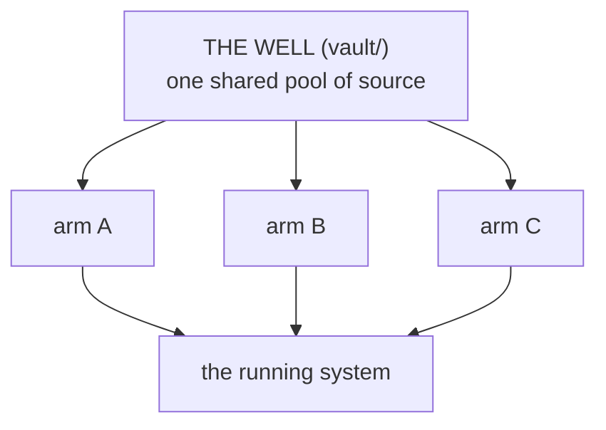

# DCA: Deferred Context Architecture

DCA is a way to build a big system out of many small parts using an AI coding
agent (like Claude Code), so that:

- **the parts can't corrupt each other** — each is built in its own folder and
  never reads any other part, so building or breaking one can't damage the rest;
- **the parts share one source of truth** — all raw material lives in one pool,
  and each part pulls only the slice it needs, when it needs it;
- **you can prove the parts actually fit** — when two parts must work together,
  a script runs both and verifies the result, and that check is built to fail
  when they don't.

It is a folder layout plus a few small scripts, not a framework you install.
You clone it, drop your source material in, and point an AI agent at one part
at a time.

## What it does, concretely

1. **You fill the well.** All raw source material goes into `vault/` (the
   *well*) and gets one row in a catalogue (`vault/account.md`) so it's
   addressable, not a pile.
2. **You stand up a part.** A part is its own workspace folder. The AI agent
   reads the files in order, top to bottom — no orchestration framework
   underneath. Its first step *draws* from the well: it pulls only the source
   its current task names, nothing speculative. (This is the "deferred context"
   in the name — context is loaded late, only when a step needs it, which is
   what stops the agent from inventing filler.)
3. **Parts stay independent.** A part reads only the shared well and the shared
   rules. It never reads another part. That's what makes "build them in any
   order, in parallel" real: nothing points to a part, so nothing can break it
   from outside.
4. **When two parts must interoperate, they share a keystone.** A *keystone* is
   a tiny contract that lives in the well — say, "a task record has exactly the
   fields `id`, `title`, `done`." Both parts build against it without ever
   seeing each other. A script then runs them together and checks the fit.

## Try the proof

The repo ships a working example: two parts (`silos/producer` and
`silos/consumer`) that have never seen each other's code, both built against one
keystone (`vault/keystone-task.md`). Run the check:

```console
$ python bin/join-check.py
keystone fields (from the well): ['done', 'id', 'title']
producer output conforms to the keystone
consumer accepted the producer's output: '3 tasks, 2 done'
falsification holds: 2 violating records injected, all rejected
PASS: two independent silos, one shared keystone, parts fit at the join, and the check can fail.
```

The last two lines are the point. The check doesn't just confirm the parts fit
— it *injects broken records and requires the consumer to reject them*, so a
PASS is earned against demonstrated failure, not assumed. A check that can't
fail proves nothing.

## The pieces

| Folder | What it is |
|---|---|
| `vault/` | The **well** — the one shared pool of source material, catalogued in `account.md`. |
| `silos/` | The **frozen proof** — the `producer` + `consumer` example above, kept exactly as it ran. Not extended. |
| `arms/` | The **operating layer** — where you do new work. An arm is a part plus the discipline to run it over time (below). |
| `keystone-forge/` | How keystones are **authored and tested** before use (`FORGE.md`). |
| `_core/` | The thin shared law + the templates you copy to make a new part. |
| `bin/` | The runnable checks: `join-check.py`, `hedge_count.py`, `scan-tools.sh`. |
| `meta-seams/` | The shared writing standard every part clears. |



## Arms: doing new work

`silos/` is frozen — it's the proof record, left as it ran. New work goes in
`arms/`. An **arm** is structurally the same as a silo (same workspace shape,
same one-way draw from the well) plus three things that make it operable over
time: a **runbook** that runs from a cold start, a **done-when** metric the
operator supplies (a session never invents it), and a **decision log** copied
to `vault/exhaust/` when the arm closes. To start one:

```bash
cp -r _core/templates/arm arms/<name>   # scaffold a new arm
python bin/join-check.py                 # re-run the proof end to end
```

Then, inside the arm: run `setup` to configure it once, fill the well, draw,
build.

## The forge: keystones are tested, not trusted

A contract is only as good as its stability. `keystone-forge/FORGE.md` carries
the creation template and a validation protocol: generate N independent outputs
per candidate contract, measure hedge-density deterministically
(`bin/hedge_count.py`), score blind, and judge on *variance*, not vibes. The
standing law is **no keystone enters production untested.** Run 001 is recorded
there, including its main finding: contracts written as *rules* stay stable
across runs, while contracts written as *goals* re-sample and wobble.

## The thesis (why it's built this way)

**Architecture is not proof.** A description of how a system should behave is
not evidence that it does. The only evidence is a run: something built, that
held or failed, recorded so the next person can check it. Composition (parts
don't corrupt each other) and integration (parts actually fit) are separate
problems — most agentic tooling solves the first and calls it done. DCA's whole
move is to make the second one *runnable*: the keystone plus `join-check.py` is
the answer to "do the parts still fit?" that you execute instead of re-reading.

## Why not the obvious alternatives

| The problem at scale | Plain ICM, one workspace | A fresh agent plan | DCA |
|---|---|---|---|
| Source bigger than any part needs | corpus overflows context or gets sampled thin | nowhere durable to hold it | the well; each part draws its slice on demand |
| Many parts that must not corrupt each other | one shape forced on all, or workspaces that drift | one long session holds everything; each new session re-plans | independent parts over one shared well |
| Telling a bad part from a good one | mediocrity smears across the whole output | visible only at the end | a bad part fails in its own folder, cheaply and visibly |

## Lineage (kept on purpose)

This is the fourth iteration. The third — M2W, a single pipeline over ~750,000
words of source with a "never discard, catalogue everything" rule — shipped
output that was competent and flat: when nothing is ever cut, nothing is ever
prioritized. Its deeper failure was structural — a thousand lines of prose
spec, one executable script, and a review method that could only confirm
internal consistency, so the checks and the work shared the same blind spot.
The failure records live in `logs/`, on purpose: working out *why* it failed is
what produced this design. The first full-scale run of the corrected structure
produced a [seven-book technical corpus](https://ai-systems-scriptorium.vercel.app/)
across six domains — evidence the shape holds at scale, not the goal itself.

## Roadmap

1. **Here (reference):** templates, proof, forge. Keystones are authored and
   tested only — none deploy into arms in this repo, which stays frozen as the
   reference.
2. **The clone (production):** this repo seeds the Deferred Revenue Architecture
   OS — a live revenue pipeline whose connectors (enrichment, CRM, content) are
   arms, each on its own contract, bound only at tested keystones. Keystones
   deploy there, one join at a time, first arm proven before the second exists.
3. Promotion is earned: the keystone becomes standing convention only after it
   holds on a second, harder case.

## References & what's not solved

The self-contained workspace whose folder structure *is* the architecture is
borrowed from [ICM (Interpreted Context Methodology)](https://github.com/RinDig/Interpreted-Context-Methdology)
by Jake Van Clief. DCA adds the shared well and the keystone on top and does not
modify ICM.

One honest limit: independence and a verified join tell you the parts don't
break each other and do fit together. They tell you nothing about whether any
one part is *worth building*. That judgment stays a human's, applied per part.
