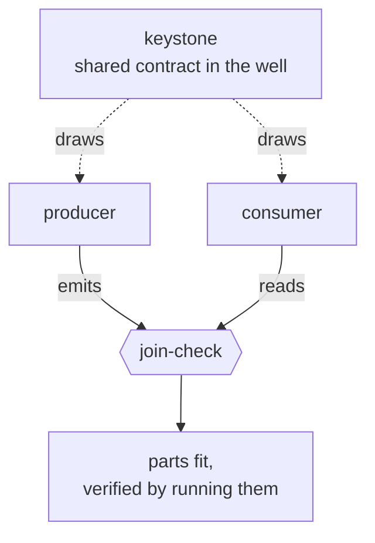

# DCA: Deferred Context Architecture

**Independent parts, one shared source of truth, a verified join between them.**

This repo is the reference implementation of an architecture for building
many-part systems with an AI coding agent — where every part can be built,
changed, or replaced on its own schedule, and where "do the parts still fit" is
a question the repo answers by *running something*, not by re-reading the plan.
It exists to become the engine of a production revenue system. The pattern is
proven here on a deliberately small case; it deploys at scale in a clone (see
[Roadmap](#roadmap)). This repo stays frozen as the reference: the proof, the
templates, the test tooling, and the recorded failures that shaped the design.

## The Thesis

**Architecture is not proof.** A specification of how a system should behave is
not evidence that it does. The only evidence is a run: something built,
something that failed or held, recorded so the next person can check it.

The working claim: a system with many moving parts stays sound when (1) its
parts are built independently, so a change in one cannot corrupt another, and
(2) they align through a shared, inspectable contract rather than by
referencing each other directly — and that alignment is *checked*, not assumed.
Composition and integration are separate problems. Most agentic tooling only
solves the first one and calls it done.

## The Shape

```
DCA/
├── vault/           the well: one shared source pool, catalogued in account.md
├── silos/           the frozen proof: producer + consumer, as they ran
├── arms/            the operating layer: where new work happens
├── keystone-forge/  how contracts are authored and validated before use
├── _core/           the thin shared law + templates (silo and arm)
├── bin/             executable checks: join-check, hedge_count, scan-tools
└── meta-seams/      shared output standards every part clears
```


**The well:** all raw material pools in `vault/`, entered by extraction or by
hand, catalogued so it is addressable rather than a pile. A part draws only
what one of its stages names, when that stage runs; nothing is pulled
speculatively. This is why a part stops inventing material on the spot: it is
always working from something real, not a blank page.

**Independence:** a part reads the well, the shared law, and the shared writing
standard. It never reads another part. This is what makes "any order, in
parallel" true rather than aspirational: a part cannot be broken by a change
somewhere else, because nothing points to it.

## The Keystone

A contract placed in the well, owned by no single part, that more than one part
agrees to build against. It is the only thing that lets two parts align without
referencing each other. **Not acted out** (it is not a persona). **Not a tool**
(it is inert — read, conformed to, checked; it never executes). Plural and tiny
— one per join, never one master contract.



The proof here is deliberately small: `vault/keystone-task.md` defines a `task`
record with exactly three fields (`id`, `title`, `done`). That file, sitting in
the well, is the entire coordination mechanism between two silos that have
never seen each other's folders. `bin/join-check.py` runs the producer's output
through the consumer, then runs its own falsification: it injects records that
violate the keystone and requires the consumer to reject each one — a pass is
earned against demonstrated failure, not assumed.

```console
$ python bin/join-check.py
keystone fields (from the well): ['done', 'id', 'title']
producer output conforms to the keystone
consumer accepted the producer's output: '3 tasks, 2 done'
falsification holds: 2 violating records injected, all rejected
PASS: two independent silos, one shared keystone, parts fit at the join, and the check can fail.
```

Independence guarantees parts don't corrupt each other. The keystone
additionally guarantees that two parts that must interoperate actually do —
checked by running them. A check that cannot fail proves nothing; this one
demonstrates its teeth on every run.

## The Forge

Contracts are engineered artifacts, and untested contracts are liabilities.
`keystone-forge/FORGE.md` carries the creation template and the validation
protocol: N independent generations per candidate contract, a deterministic
hedge-density metric (`bin/hedge_count.py`), blind operator scoring, and pass
conditions measured on *variance*, not vibes. The standing law: **no keystone
enters production untested.** Run 001's results are recorded in the forge —
including the finding that contracts encoding rules stabilize while contracts
encoding goals re-sample and wobble, and the boundary conditions of that claim.

## Arms: The Operating Layer

The proof is preserved exactly as it ran — `silos/` is frozen as the operating
record. New work goes in `arms/`. An **arm** is structurally a silo (same
workspace shape, same one-way draw from the well) plus the discipline that
makes it operable over time: a runbook that runs cold, a done-when metric the
operator supplies, and a decision log copied to `vault/exhaust/` when the arm
closes. Arms are where this architecture stops being a diagram and starts being
an operations pattern: quarantined functions, each holding one job, so the
coordinating layer never has to hold everything at once.

## Lineage (kept on purpose)

This is the fourth iteration. The third — M2W, a single pipeline over ~750,000
words of source with a "never discard, catalogue everything" rule — shipped
output that was competent and flat: when nothing is ever cut, nothing is ever
prioritized. Its deeper failure was structural: a thousand lines of prose
specification, one executable script, and a verification method (model review
passes) that could only confirm internal consistency — the checks and the work
shared the same blind spot, so agreement between them meant nothing. The
failure records live in `logs/` and the M2W history remains public, because
working out *why* it failed is what produced this design. The first full-scale
run of the corrected structure produced a seven-book technical corpus in six
domains — cited here as evidence the shape holds at scale, not as the goal. The
goal is the system this repo seeds.

## Why This Structure, Not the Obvious Alternatives

| The problem at scale | Plain ICM, one workspace | A fresh agent plan | DCA |
|---|---|---|---|
| Source bigger than any part needs | corpus overflows context or gets sampled thin | nowhere durable to hold it | the well; each part draws its slice on demand |
| Many parts that must not corrupt each other | one shape forced on all, or workspaces that drift | one long session holds everything; each new session re-plans | independent parts over one shared well |
| Telling a bad part from a good one | mediocrity smears across the whole output | visible only at the end | a bad part fails in its own folder, cheaply and visibly |

The honest version: the fourth attempt did not work because the agent got
better at writing. It worked because the structure finally made a bad part show
itself, in its own folder, instead of hiding inside one big system.

## Roadmap

1. **Here (reference):** templates, proof, forge. Keystones are authored and
   tested only — none deploy into arms in this repo.
2. **The clone (production):** this repo seeds the Deferred Revenue
   Architecture OS — a keystoned operating system for a live revenue pipeline,
   with connectors (enrichment, CRM, content) as arms, each on its own
   contract, bound only at tested keystones. Keystones deploy there, one join
   at a time, first arm proven before the second exists.
3. Promotion is earned: the keystone mechanism becomes standing convention only
   after it holds on a second, harder case.

## Start

Read `CLAUDE.md` for the canonical read order. To stand up a new part:

```bash
cp -r _core/templates/arm arms/<name>     # scaffold a new arm from the template
python bin/join-check.py                  # re-run the proof end to end
```

Then, inside the arm: run `setup` to configure it once, fill the well, draw,
build.

## References

The self-contained workspace whose folder structure is the architecture is
borrowed from [ICM (Interpreted Context Methodology)](https://github.com/RinDig/Interpreted-Context-Methdology)
by Jake Van Clief: one agent reading files in order instead of a multi-agent
framework. DCA adds the shared well and the keystone on top of it and does not
modify ICM.

## What Is Not Solved

Independence and a verified join tell you the parts don't break each other and
do fit together. They tell you nothing about whether any one part is worth
building. That judgment is a human's, applied per part, and no architecture in
this repo claims otherwise.
