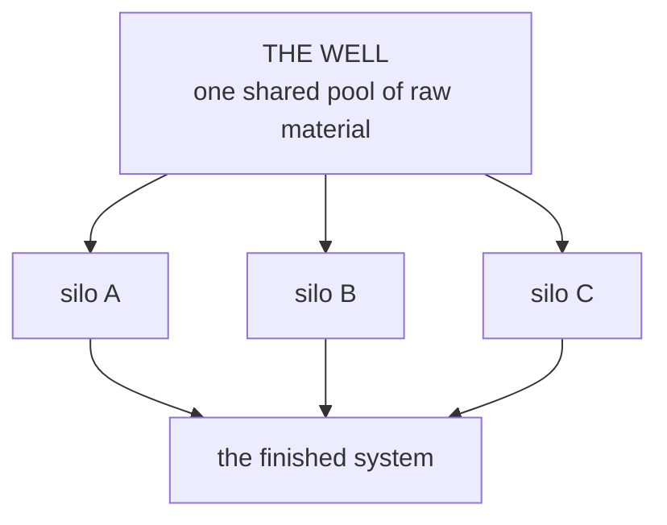
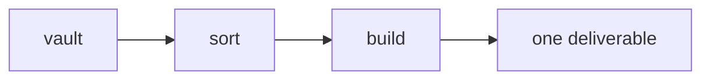
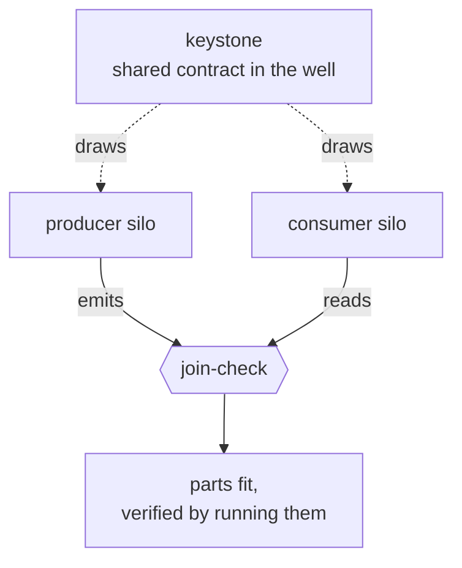

# DCA: Deferred Context Architecture
### (Formerly M2W: Manifest to Workspace)

## Why I Built This

I want to learn AI systems engineering, and the courses that teach it well run $3,000 to $5,000. I
couldn't spend that. So I set myself a different problem: could I use Claude Code, an AI coding agent,
to help me build the learning material myself, on subjects I am not yet an expert in?

The honest first answer was no. My first attempt produced a pile of polished material that was quietly
mediocre, and worse, I couldn't tell it was mediocre from inside the system that made it. I've kept
that failure in this repo instead of hiding it, because working out *why* it happened is what actually
taught me something worth keeping. This is the second attempt, built around that lesson.

**Independent parts, one shared source of truth, a verified join between them.** DCA builds *silos*,
self-contained workspaces that each produce one part of a larger system, over a single shared vault of
raw material.



## The Thesis

**Architecture is not proof.** A specification of how a system should behave is not evidence that it
does. The only evidence is a run: something built, something that failed or held, recorded so the next
person can check it. Most of the work in this repo, across both versions, was learning that the hard
way: building elaborate structure, mistaking its elegance for a result, and eventually building
something small enough to actually run and watch fail or hold.

The working claim now: a system with many moving parts stays sound when (1) its parts are built
independently, so a change in one cannot corrupt another, and (2) they align through a shared,
inspectable contract rather than by referencing each other directly, and that alignment is *checked*,
not assumed. Composition and integration are separate problems. Most agentic tooling only solves the
first one and calls it done.

## What M2W Was, And Why It Failed

M2W was a single pipeline: one shared vault, one sorting stage, one build stage, one deliverable.



Its governing rule was "defer and preserve": never discard, catalogue everything, escalate anything
uncertain to a human. That rule is a defensible position for holding raw material. It is also a
description of how an averaged, unopinionated deliverable gets produced: if nothing is ever cut,
nothing is ever prioritized, and every output part gets equal weight whether or not it deserves it.
M2W ran once, on roughly 750,000 words of collected primary source across six domains, and the
deliverable it shipped read as competent and flat, correct and forgettable. The scale is the point:
that much real input producing that flat an output is not a lack of material or effort. It was the
direct output of an architecture whose founding value was hoarding, not cutting.

The deeper problem was structural, not stylistic. M2W's "engine" was roughly a thousand lines of
markdown specification and exactly one executable script, which checked which tools were installed.
Every stage (sort, catalogue, build, ship) was prose that a human-directed agent interpreted at read
time. Nothing ran on its own. It was a specification of an orchestration engine, not one, and the gap
between those two things was never checked, because the verification method available, repeated review
passes by the same kind of model checking the spec against itself, could only confirm internal
consistency. It could not tell you whether the output was good, because "is this good" was never
inside what that method could observe. Every review came back clean. That was the failure mode, not
the fix: the checks and the work shared the same blind spot, so agreement between them meant nothing
about the thing they were supposedly checking.

## What Changed

DCA keeps the parts of M2W that were sound (a shared source pool, deferred loading, glass-box state,
single-agent execution) and inverts the part that wasn't. The unit of work is no longer one pipeline
building one thing. It is many independent silos, each a small self-contained workspace, each pulling
only the slice of shared material it actually needs, each built without knowledge of the others.

```
DCA/
├── vault/        the well: one shared source pool, catalogued in account.md
├── silos/        the parts: self-contained workspaces, built in any order
├── _core/        the thin shared law + the silo template
└── meta-seams/   shared output standards every silo clears
```

**The well:** all raw material pools in one vault, entered by extraction or by hand, catalogued so it
is addressable rather than a pile. A silo draws only what one of its stages names, when that stage
runs; nothing is pulled speculatively. This is why a silo stops inventing material on the spot: it is
always working from something real, not a blank page.

**Silos:** each is a self-contained workspace with its own folder, its own stages, and its own
configuration. The folder structure itself carries the instructions: one agent reads the files in
order, top to bottom, with no orchestration framework underneath. You configure a silo once, then run
it per deliverable, so an agent only ever loads the files a given step needs, not the whole workspace.
The pattern is borrowed, not invented (see [References](#references)), and it already worked once
before this repo existed: [seven finished technical books](https://ai-systems-scriptorium.vercel.app/),
built in any order, none blocking another, no shared pipeline between them.

**Independence:** a silo reads the well, the shared law, and the shared writing standard. It never
reads another silo. This is what makes "any order, in parallel" true rather than aspirational: a silo
cannot be broken by a change somewhere else, because nothing points to it.

## How It Works

**From well to silo, step by step:** raw material enters `vault/` and gets a row in `vault/account.md`.
A silo's first stage, `01-draw`, reads that catalogue and pulls only the pieces it needs into its own
folder; nothing else in the well is touched. Later stages in that silo build from what was drawn.
Every silo repeats this independently, and none of them see each other's folders.

**The keystone:** a contract placed in the well, owned by no single silo, that more than one silo
agrees to build against. It is the only thing that lets two parts align without referencing each
other.



The proof in this repo is deliberately small: `vault/keystone-task.md` defines a `task` record with
exactly three fields (`id`, `title`, `done`). That file, sitting in the well, is the entire
coordination mechanism between the two silos in the diagram.

**Producer and consumer:** roles a silo can take against a keystone, not a fixed pair the architecture
requires, illustrated here by two silos literally named that. `silos/producer` draws the keystone and
builds something that *emits* records matching it. `silos/consumer` draws the same keystone and builds
something that *reads* records assuming it holds. Neither silo has ever seen the other's folder or
code. Both only know the keystone. `bin/join-check.py` runs the producer's output through the
consumer, then runs its own falsification: it injects records that violate the keystone and requires
the consumer to reject each one, so a pass is earned against demonstrated failure, not assumed. The
run record (reproduced in `silos/PROOF.md`):

```console
$ python bin/join-check.py
keystone fields (from the well): ['done', 'id', 'title']
producer output conforms to the keystone
consumer accepted the producer's output: '3 tasks, 2 done'
falsification holds: 2 violating records injected, all rejected
PASS: two independent silos, one shared keystone, parts fit at the join, and the check can fail.
```

**Why silos, not one generated workspace:** a typical workspace generator, used the ordinary way once
per system, produces a single shape, decided at setup, and holds every part of what you're building to
it. That works when the system really is one thing. It breaks the moment it isn't: a product's API,
its docs, and its onboarding flow don't need the same stages or the same voice, and forcing them
through one template is the same failure as M2W's hoarding in a different costume: one shape, applied
uniformly, regardless of whether it fits the part. DCA doesn't generate one workspace. It generates as
many as the system has real parts, each shaped for what it actually is (its own stage count, its own
build chain, its own setup), and lets them stay one system not by sharing a shape, but by sharing a
well and, wherever two parts must actually interoperate, a keystone. The shape is free to vary per
part. The join is not.

Independence guarantees parts don't corrupt each other. The keystone is what additionally guarantees
two parts that must interoperate actually do, checked by running them, not assumed from the plan. That
gap is one M2W never had to face, because M2W only ever built one thing. The keystone proof above is a
small answer to one instance of it, not a finished system, but it is the first thing in either version
of this repo with an actual operating history instead of a specification.

## What We Hope To Accomplish

Build systems with several real, interoperating parts, not a single deliverable, where every part can
be built, changed, or replaced on its own schedule, and where "do the parts still fit" is a question
the repo can answer by running something, not by re-reading the plan. The keystone mechanism is the
first candidate answer to that question. It gets promoted from proof into standing convention only
after it holds on a second, harder case: earned, not assumed, which is the discipline the first
version of this repo talked about and did not consistently practice.

What is not solved, stated plainly: independence and a verified join tell you the parts don't break
each other and do fit together. They tell you nothing about whether any one part is worth building.
That judgment is still a human's, applied per part, and no architecture in this repo claims otherwise.

## Start

Read `CLAUDE.md` for the canonical read order. To stand up a new part:

```bash
cp -r _core/templates/silo silos/<name>   # scaffold a new silo from the template
python bin/join-check.py                   # run the proof end to end
```

Then, inside the silo: run `setup` to configure it once, fill the well, draw, build.

## References

The silo, a self-contained workspace whose folder structure is the architecture, is borrowed from
[ICM (Interpreted Context Methodology)](https://github.com/RinDig/Interpreted-Context-Methdology) by
Jake Van Clief: one agent reading files in order instead of a multi-agent framework. DCA adds the
shared well and the keystone on top of it and does not modify ICM.

Prior work: the [seven-book scriptorium](https://ai-systems-scriptorium.vercel.app/), where the
one-workspace-per-part pattern first ran.
